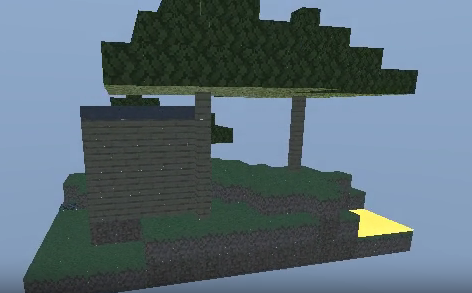

# 🧱 Proyecto 2 – Raytracing: *Minecraft Mine RT*

> **Autor:** Juan Menéndez 
> **Curso:** Gráficas Computacionales  
> **Lenguaje:** Rust  
> **Tema:** Raytracer estilo *Minecraft*, con materiales, reflexión, refracción y skybox dinámico.

---

### 🎥 Vista previa del resultado

<p align="center">
  
</p>

> 🌄 Render final: `diorama.mp4`  
> _(una vuelta completa de cámara sobre la escena)_

---

## 📦 Descripción del proyecto

Este proyecto implementa un **motor de raytracing básico en Rust**, desarrollado desde cero para generar un diorama 3D inspirado en *Minecraft*.  
El render se realiza **sin librerías gráficas externas**: cada píxel se calcula mediante intersecciones de rayos con cubos (`AABB`), aplicando modelos de **iluminación difusa, especular, reflexión y refracción**.

La escena simula un pequeño entorno natural y construido:
- Bloques de **tierra, césped, piedra, madera, vidrio, hojas, agua y lava** con texturas reales en formato `.ppm`.
- Una **casa de madera** con ventanas y techo de piedra.
- **Montículos de terreno** generados por función de altura.
- **Varios árboles** de diferentes tamaños con copas escalonadas.
- Un **lago y una piscina de lava** ubicados coherentemente.
- Un **skybox día/noche** que cambia suavemente durante la animación.

---

## ⚙️ Estructura principal

```
minecraft_mine_rt/
│
├─ src/
│  ├─ main.rs          → ciclo principal y animación de cámara
│  ├─ scene.rs         → definición del diorama
│  ├─ renderer.rs      → trazado recursivo (reflexión/refracción)
│  ├─ aabb.rs          → colisiones con cubos
│  ├─ texture.rs       → texturas PPM y procedurales
│  ├─ material.rs      → parámetros ópticos por material
│  ├─ skybox.rs        → gradiente día/noche
│  └─ math.rs, color.rs, ppm.rs, camera.rs
│
├─ assets/
│  └─ textures/        → imágenes .ppm (grass, dirt, stone, etc.)
│
├─ out/                → frames generados .ppm
│
├─ demo0.png           → imagen de referencia
└─ diorama.mp4         → video final del render
```

---

## 🧠 Conceptos implementados

| Concepto | Descripción breve |
|-----------|------------------|
| **Raytracing** | Cálculo de intersección rayo-cubo (AABB) con normales, UV y materiales. |
| **Iluminación** | Luz direccional con componentes difusas y especulares (modelo Blinn-Phong). |
| **Reflexión y refracción** | Aplicadas mediante Fresnel (Schlick) con profundidad recursiva. |
| **Materiales** | Cada tipo de bloque tiene su propio conjunto de propiedades ópticas. |
| **Texturas reales** | Imágenes `.ppm` derivadas de texturas de Minecraft. |
| **Skybox** | Interpolación de color día/noche en función del tiempo. |
| **Animación de cámara** | Órbita completa, con control de distancia y altura. |

---

## 🧩 Cómo ejecutar

1. Instalar **Rust**:
   ```bash
   rustup update
   ```
2. Compilar en modo release:
   ```bash
   cargo run --release
   ```
3. Combinar frames con FFmpeg:
   ```bash
   ffmpeg -framerate 30 -i out/frame_%04d.ppm -pix_fmt yuv420p -crf 18 diorama.mp4
   ```

---

> *“A veces basta un cubo bien iluminado para entender cómo se construye un mundo completo.”*
